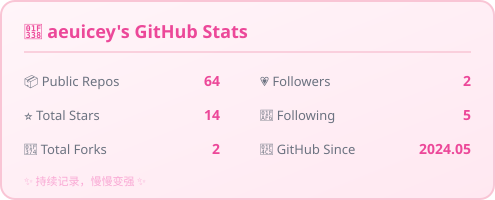
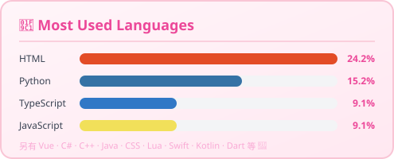

  

  # 🌸 欢迎光临 aeuicey 的小窝 🌸

 

---

## 🎀 关于我

- 🌷 坐标南京的在读大学生，专业是 **工程管理**
- 📖 日常在学和用的技术栈：`SERN`（SQL Server · Express · React · Node.js）
- 🔭 折腾过的方向：博客搭建、B 站生态小工具、桌面小软件、AI Skill
- 🌱 欢迎来我的仓库开 `Issue` / 提 `PR`，或者只是打个招呼也行～
- 💬 信条：把复杂的问题拆开，然后一块一块吃掉它 🍰

---

## 🧸 技能树

  

| 分类 | 内容 |
| :--- | :--- |
| 🖥️ 语言 | JavaScript · TypeScript · Java · Python · C# |
| 🌐 前端 | React · HTML/CSS |
| ⚙️ 后端 | Node.js · Express |
| 🗄️ 数据 | SQL Server |
| 🛠️ 工具 | Git · VS Code · IDEA |

---

## ⭐ 我的宝贝项目

| 项目 | 简介 |
| :--- | :--- |
| 📝 **Hexo 博客静态资源存储库** | 个人博客的图片与静态资源仓库 |
| 📺 **B 站视频播放器插件（Halo）** | 为 Halo 博客提供 B 站视频嵌入，支持扫码登录、DASH 音画分离、多清晰度切换 |
| 🔗 **BiliAnalysis 服务端** | B 站视频 / 直播 CDN 直链解析 API 的部署版 |
| 📅 **全自动课表流水线 Skill** | 大模型 Skill：识别课表文档 → 提取结构化数据 → 导出多种格式并接入日历 |
| 🎵 **Unlock Music 单文件版** | 将 Unlock Music 编译为免安装绿色 EXE，双击即用 |
| 🎧 **Cavern（汉化中）** | Fork 自 VoidXH/Cavern，基于对象的音频引擎，支持 Dolby Atmos 渲染 |

---

## 📊 GitHub 小数据

  
  

   

  

   

  

---

## 📮 找到我

  
  
  

---

  ✨ 愿每一行代码都被温柔以待 ✨

  ⭐ 感谢你的到访，欢迎 Star 和 Follow 呀～ ⭐

